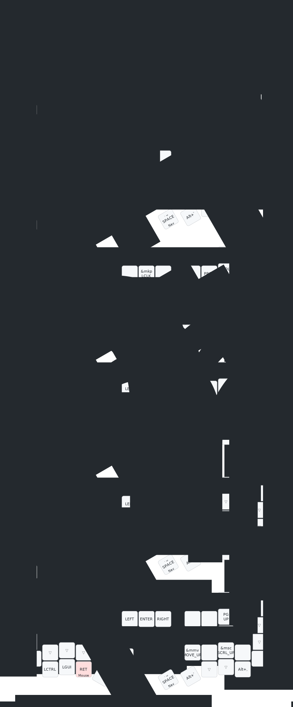

# Eyelash Sofle — ZMK Config

My personal [ZMK](https://zmk.dev) configuration for the **Eyelash Sofle** split
keyboard — a urob-style home-row-mod layout with smart layers, a tri-state
Cmd-Tab swapper, mouse emulation, RGB underglow, a rotary encoder, and an
animated `nice-view-gem` display.

## Keymap

*Rendered automatically by [keymap-drawer](https://github.com/caksoylar/keymap-drawer)
on every keymap change. For a text cheat sheet of the layers and the "smart"
keys, see **[KEYMAP.md](KEYMAP.md)**.*

## What's in here

| | |
|---|---|
| **Board** | `nice_nano_v2` + `eyelash_sofle` shield (manufacturer: [a741725193/zmk-sofle](https://github.com/a741725193/zmk-sofle)) |
| **Firmware** | [`cormoran/zmk`](https://github.com/cormoran) fork `v0.3-branch+dya` (the fork the board targets) |
| **Display** | [nice-view-gem](https://github.com/M165437/nice-view-gem) — status screen + peripheral animation |
| **Home-row mods / helpers** | [urob](https://github.com/urob/zmk-config) `zmk-helpers`, `zmk-auto-layer`, `zmk-tri-state` |
| **Layers** | Base · Nav · Fn · Num · Sys · Mouse |

## Building & flashing

Firmware builds on **GitHub Actions** on every push.

1. Open the latest green run under [**Actions**](../../actions/workflows/build.yml) → download the `firmware` artifact → unzip.
2. Put each half into bootloader (double-tap reset) and copy the matching `.uf2`:
   - `settings_reset.uf2` to **both** halves first (clears old pairing) — recommended after big firmware jumps.
   - `eyelash_sofle_left ... nice_view_gem.uf2` → left half.
   - `eyelash_sofle_right ... nice_view_gem.uf2` → right half.

## Credits

Forked from [floating-cat/zmk-config-eyelash-sofle-corne](https://github.com/floating-cat/zmk-config-eyelash-sofle-corne),
with the layout and helpers based on [urob/zmk-config](https://github.com/urob/zmk-config).
